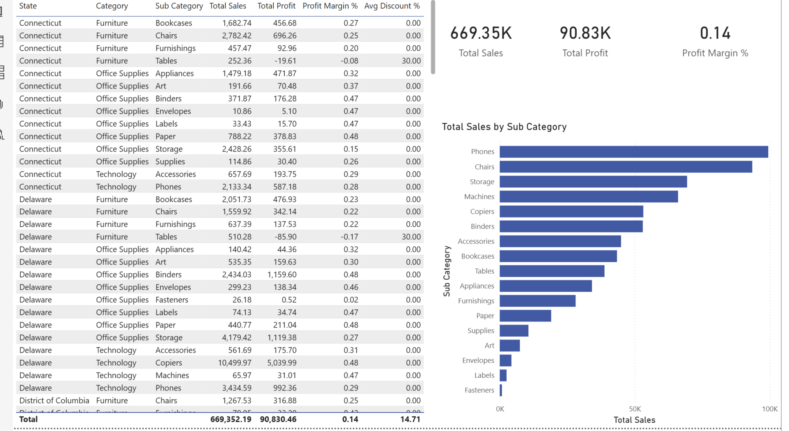
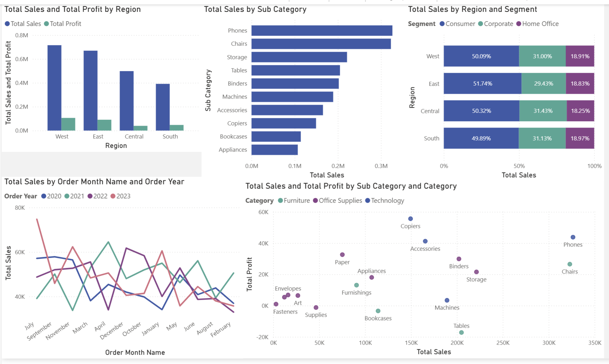
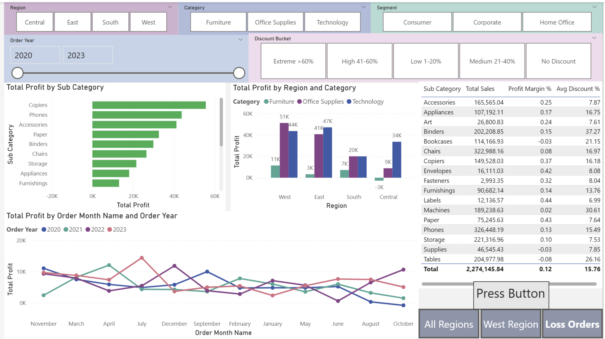
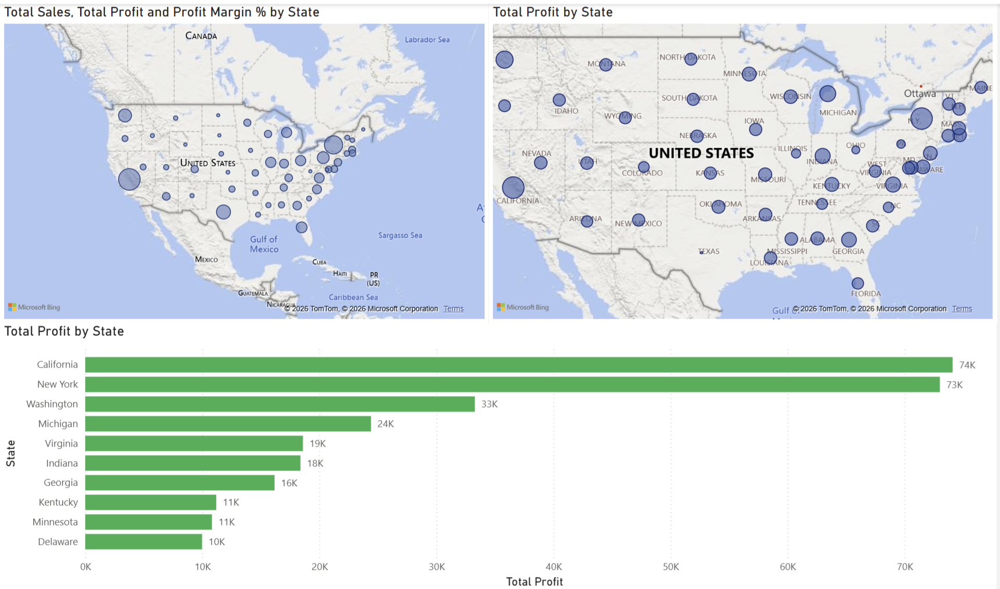

# 📊 Sample Superstore — End-to-End Business Intelligence Project


---

## 📌 Project Overview

A full end-to-end business intelligence project built on the **Sample Superstore** retail dataset — covering data ingestion, cleaning, exploratory data analysis, advanced SQL analytics, and an interactive Power BI dashboard. This project mirrors the complete analyst workflow used at top-tier firms: raw data → cleaned data → insights → visualisation → business recommendations.

## Dashboard Preview



---
---

## 🎯 Business Questions Answered

- Which regions, categories and sub-categories are most and least profitable?
- What is the impact of discounting on profit margins?
- Which customer segments generate the highest revenue and profit?
- Which states are loss-making and why?
- How do shipping modes affect profitability and delivery performance?
- What are the month-over-month and year-over-year sales trends?
- Which sub-categories should be discontinued or repriced?

---

## 🗂️ Project Architecture

```
Raw Data (Excel/CSV)
        ↓
Microsoft SQL Server
        ↓
Data Cleaning (SQL)
        ↓
Exploratory Data Analysis (SQL)
        ↓
Production Views & Stored Procedures (SQL)
        ↓
Power BI Desktop
        ↓
Interactive Dashboard (4 pages)
```

---

## 📁 Repository Structure

```
├── data/
│   └── SampleSuperstore.csv          # Raw dataset
├── sql/
│   ├── 01_create_database.sql        # Database and table setup
│   ├── 02_data_cleaning.sql          # Null checks, duplicates, type fixes
│   ├── 03_eda_sales.sql              # Sales EDA queries
│   ├── 04_eda_profit.sql             # Profit EDA queries
│   ├── 05_eda_segment_shipping.sql   # Segment & shipping analysis
│   ├── 06_views.sql                  # vw_master_eda, vw_region_performance, vw_subcat_profitability
│   ├── 07_stored_procedures.sql      # Parameterised reporting procedures
│   └── 08_indexes.sql                # Performance indexes
├── powerbi/
│   └── SampleSuperstore.pbix         # Power BI dashboard file
└── README.md
```

---

## 🛠️ Tech Stack

| Tool | Purpose |
|------|---------|
| Microsoft SQL Server | Data storage, cleaning, transformation, EDA |
| SQL Server Management Studio (SSMS) | Query execution and database management |
| Power BI Desktop (Free) | Dashboard development and visualisation |
| Power Query (M Language) | Data transformation before model load |
| DAX | Dynamic measures and KPI calculations |

---

## 📊 Dataset

**Source:** [Sample Superstore — Kaggle](https://www.kaggle.com/datasets/bravehart101/sample-supermarket-dataset)

| Property | Detail |
|----------|--------|
| Rows | 9,994 |
| Columns | 13 |
| Date Range | 2020 – 2023 (synthetic) |
| Geography | United States |
| Nulls | 1 (resolved) |
| Duplicates | Removed via ROW_NUMBER() |

**Columns:** Ship Mode, Segment, Country, City, State, Postal Code, Region, Category, Sub-Category, Sales, Quantity, Discount, Profit

---

## 🧹 Data Cleaning (SQL)

All cleaning performed in Microsoft SQL Server before loading into Power BI.

- **NULL detection** across all 13 columns using `CASE WHEN IS NULL`
- **Duplicate removal** using `ROW_NUMBER() OVER (PARTITION BY ...)` — identified and deleted exact duplicate rows
- **Data type standardisation** using `CAST()` and `DECIMAL(10,2)` precision
- **String cleaning** using `TRIM()`, `UPPER()`, `LOWER()`, `REPLACE()` on all text columns
- **Calculated columns added:** `Order_Date`, `Ship_Date` (DATE type), `Profit Status`, `Discount Bucket`
- **NULLIF()** used throughout to prevent divide-by-zero errors in margin calculations

---

## 🔍 Exploratory Data Analysis (SQL)

### Sales Analysis
- Overall KPIs: total revenue, orders, units sold, avg order value, min/max order
- Sales breakdown by Region, Category, Segment, Ship Mode — with % of total
- Top 10 and Bottom 10 states by sales
- Sub-category deep dive with running totals, ranks and % contribution
- Monthly and quarterly sales trends

### Profit Analysis
- Overall profit health: total profit, margin %, loss order count, worst single loss
- Profit by Region × Category with loss flagging
- Loss-making sub-categories identified with full discount analysis
- **Key finding:** Discount buckets above 40% consistently produce negative profit margins
- Monthly profit trend with month-over-month growth %

### Segment & Shipping Analysis
- Full customer segment profiling — Consumer, Corporate, Home Office
- Segment × Category × Region cross analysis
- Shipping mode performance: avg ship days, sales, profit, discount per mode
- Shipping preference by segment and region

### Advanced Analytics
- **Window functions:** RANK, DENSE_RANK, ROW_NUMBER, running totals, % of total
- **LAG/LEAD:** Month-over-month sales and profit growth
- **NTILE(4):** Performance quartile bucketing of all orders
- **PERCENTILE_CONT:** Median profit vs average profit per category
- **PIVOT:** Quarterly sales by region, profit by segment cross-tab

---

## 🗄️ Production SQL Objects

### Views Created
| View | Purpose |
|------|---------|
| `vw_master_eda` | Master analysis view — all dimensions, all KPIs, ranks, % contribution |
| `vw_region_performance` | Region-level KPI summary |
| `vw_subcat_profitability` | Sub-category profitability with profit status labels |

### Stored Procedures
| Procedure | Parameters | Purpose |
|-----------|-----------|---------|
| `usp_region_performance` | None | Full region KPI report |
| `usp_sales_by_region` | `@Region` | Filtered sales by any region |
| `usp_category_segment_analysis` | `@Category`, `@Segment`, `@TotalProfit OUTPUT` | Cross-filtered analysis with output parameter |

### Indexes
```sql
idx_region          -- on Region column
idx_category        -- on Category column
idx_region_category -- composite on Region + Category
idx_state           -- on State column
idx_segment         -- on Segment column
```

---

## 📈 Power BI Dashboard

**4 pages — all interconnected with slicers and drill-through**

### Page 1 — Executive Summary
- 7 KPI cards: Total Sales, Total Profit, Profit Margin %, Total Orders, Loss Orders, Avg Order Value, Sales YTD
- Donut chart: Sales by Category
- Bar chart: Profit by Region
- Line chart: Monthly Sales Trend

### Page 2 — Sales Analysis
- Clustered column: Sales & Profit by Region
- Horizontal bar: Top 10 Sub-Categories by Sales
- Line chart: Monthly Sales Trend by Year (2020–2023)
- Scatter chart: Sales vs Profit by Sub-Category ← identifies high-sales/low-profit products
- 100% Stacked bar: Sales % by Segment per Region

### Page 3 — Geographic Analysis
- Bubble map: Sales by State (bubble size = sales volume)
- Bar chart: Top 10 States by Profit (red/green conditional formatting)
- Bar chart: Top 10 Cities by Sales

### Page 4 — Profit Analysis
- 5 slicers: Region, Category, Segment, Year, Discount Bucket
- Bar chart: Profit by Sub-Category (red = loss, green = profit)
- Column chart: Profit by Region and Category
- Table: Sub-Category breakdown with Sales, Profit Margin %, Avg Discount %
- Line chart: Monthly Profit Trend by Year
- 3 bookmark buttons: All Regions, West Region, Loss Orders

### Drill-Through Page — Detail View
- Right-click any region → Drill through → full breakdown table + charts for that region only

---
## Dashboard Gallery

### 1. Dashboard Overview


### 2. Executive Summary


### 3. Sales Analysis


### 4. Customer Segment Analysis


### 5. Profit Analysis


---

## 📐 DAX Measures (15 core + advanced)

```
Total Sales          Total Profit         Total Orders
Total Quantity       Profit Margin %      Avg Order Value
Avg Discount %       Loss Orders          Profitable Orders
Loss Order %         Total Loss Amount    Sales YTD
Profit YTD           Sales Previous Month Sales MoM Growth %
Revenue After Discount    Profit Per Unit
West Technology Sales     Consumer Profit
High Discount Loss        Sales % of All Regions
Sales Ignoring Region Filter
```

---

## 💡 Key Business Insights

1. **West region** drives the highest sales ($725K) and profit ($108K) — strongest market
2. **Central region** has high sales but the lowest profit margin — over-discounting suspected
3. **Furniture category** generates $742K revenue but only $18K profit — near-zero margin
4. **Tables and Bookcases** sub-categories are loss-making across all regions
5. **Discounts above 40%** consistently produce negative profit — discount policy needs review
6. **Technology** is the most profitable category with a 17% margin
7. **Consumer segment** generates the most orders but **Corporate** has higher avg order value
8. **Standard Class** shipping accounts for 60% of all orders

---

## 🚀 How to Run This Project

### SQL Setup
1. Install Microsoft SQL Server and SSMS
2. Create database: `CREATE DATABASE superstore_db;`
3. Run `01_create_database.sql` to create and load the table
4. Run scripts `02` through `08` in order

### Power BI Setup
1. Install Power BI Desktop (free)
2. Open `SampleSuperstore.pbix`
3. Click **Transform data → Data source settings**
4. Update server name to your local SQL Server instance:
   ```sql
   SELECT @@SERVERNAME -- run this in SSMS to get your server name
   ```
5. Click **Refresh** — dashboard loads with live data

---

## 👤 Author

Built as a comprehensive end-to-end data analytics portfolio project covering the full analyst stack — from raw data ingestion through SQL analysis to interactive business dashboard.

---

## 📄 License

This project uses the Sample Superstore public dataset available on Kaggle. For educational and portfolio purposes only.
