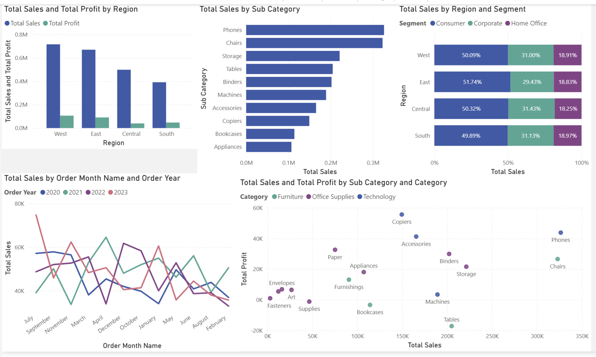
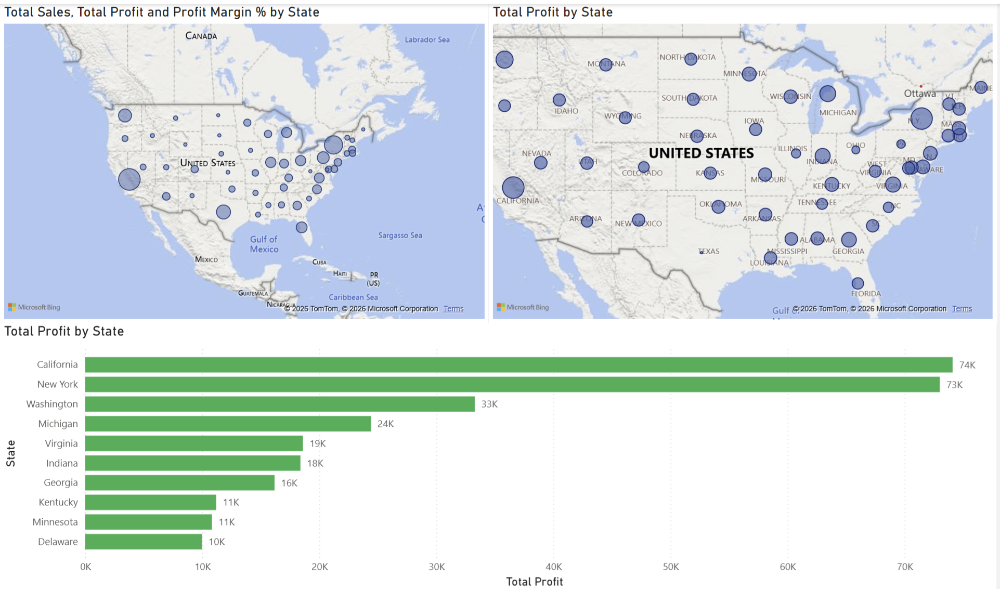
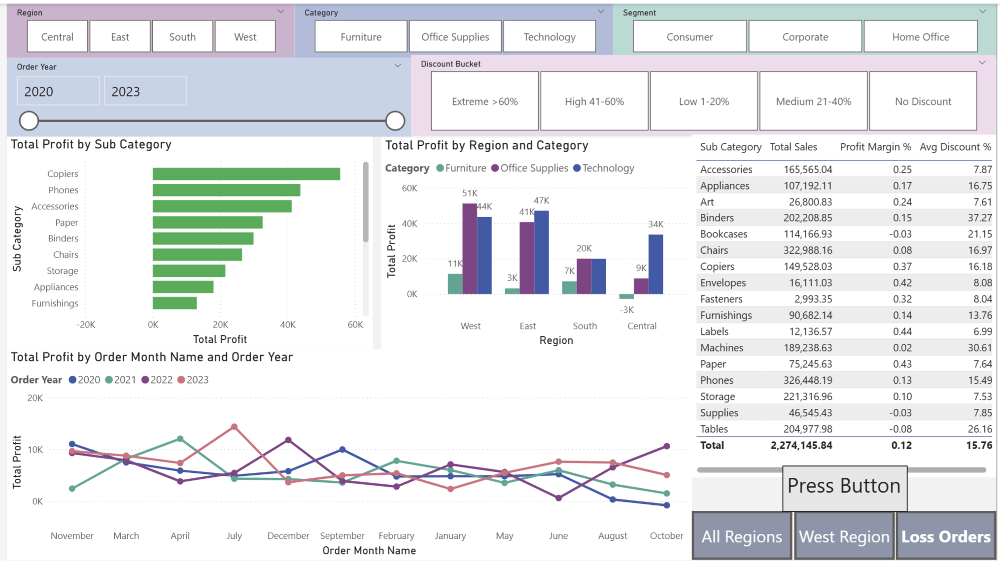
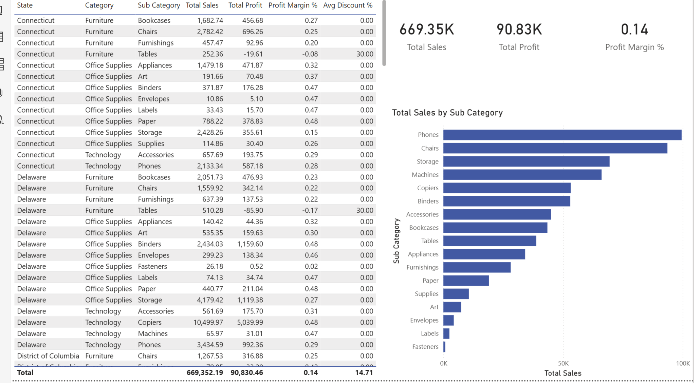
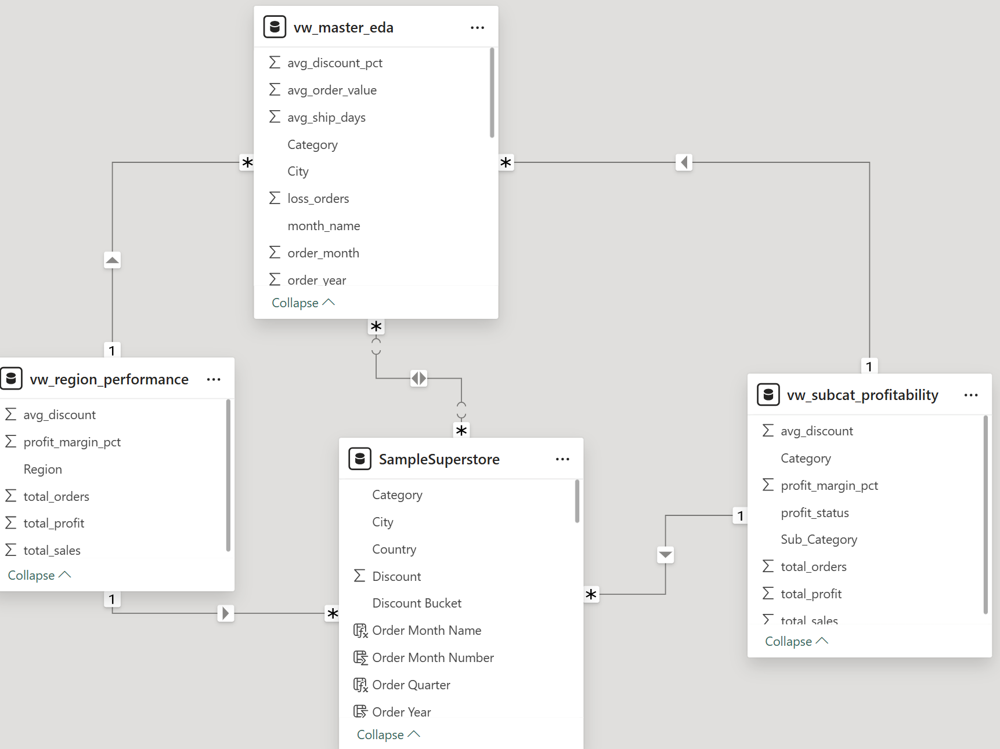

````markdown
# 📊 Sample Superstore — End-to-End Business Intelligence Project


---

## 📌 Project Overview

This project uses the **Sample Superstore** retail dataset to analyse sales, profitability, discounting, customer segments and regional performance.

I used **SQL Server** to clean and analyse the data, created reusable views and stored procedures, and then built a **4-page Power BI dashboard** for reporting and deeper analysis.

The project follows a simple analyst workflow:

**raw data → cleaning → analysis → business findings → Power BI dashboard**

## Dashboard Preview


---

## 🎯 Business Questions

The analysis was built around a few practical questions:

- Which regions, categories and sub-categories generate the most sales and profit?
- Where is the business losing money?
- How much does discounting affect profit?
- Which customer segments perform best?
- Which states and cities contribute most to sales and profit?
- How does shipping mode relate to performance?
- How are sales and profit changing over time?
- Which products may need pricing or discounting changes?

---

## 🗂️ Project Architecture

```
Raw Data (Excel/CSV)
        ↓
Microsoft SQL Server
        ↓
Data Cleaning (SQL)
        ↓
Exploratory Data Analysis (SQL)
        ↓
Views & Stored Procedures
        ↓
Power BI Desktop
        ↓
Interactive Dashboard
```

---

## 📁 Repository Structure

```
├── data/
│   └── SampleSuperstore.csv          # Raw dataset
├── sql/
│   ├── 01_create_database.sql        # Database and table setup
│   ├── 02_data_cleaning.sql          # Null checks, duplicates, type fixes
│   ├── 03_eda_sales.sql              # Sales EDA queries
│   ├── 04_eda_profit.sql             # Profit EDA queries
│   ├── 05_eda_segment_shipping.sql   # Segment & shipping analysis
│   ├── 06_views.sql                  # Reusable SQL views
│   ├── 07_stored_procedures.sql      # Parameterised reporting procedures
│   └── 08_indexes.sql                # Performance indexes
├── powerbi/
│   └── SampleSuperstore.pbix         # Power BI dashboard file
└── README.md
```

---

## 🛠️ Tech Stack

| Tool | Purpose |
|------|---------|
| Microsoft SQL Server | Data storage, cleaning and analysis |
| SQL Server Management Studio (SSMS) | Writing and running SQL |
| Power BI Desktop | Dashboard development and visualisation |
| Power Query | Data transformation before loading |
| DAX | Measures and KPI calculations |

---

## 📊 Dataset

**Source:** [Sample Superstore — Kaggle](https://www.kaggle.com/datasets/bravehart101/sample-supermarket-dataset)

| Property | Detail |
|----------|--------|
| Rows | 9,994 |
| Columns | 13 |
| Date Range | 2020 – 2023 (synthetic) |
| Geography | United States |
| Nulls | 1 resolved |
| Duplicates | Checked and removed using `ROW_NUMBER()` |

**Columns:** Ship Mode, Segment, Country, City, State, Postal Code, Region, Category, Sub-Category, Sales, Quantity, Discount, Profit

---

## 🧹 Data Cleaning

The data was cleaned in SQL Server before the main analysis.

Main cleaning steps included:

- checking all 13 columns for missing values
- identifying duplicates with `ROW_NUMBER()`
- standardising data types using `CAST()`
- cleaning text using `TRIM()`, `UPPER()`, `LOWER()` and `REPLACE()`
- converting date fields into proper SQL `DATE` values
- creating useful fields such as `Profit Status` and `Discount Bucket`
- using `NULLIF()` to avoid divide-by-zero errors in calculations

The aim was simply to make sure the data was reliable before using it for analysis and Power BI.

---

## 🔍 Exploratory Data Analysis

### Sales Analysis

I looked at:

- total sales
- total orders
- units sold
- average order value
- sales by region
- sales by category
- sales by customer segment
- sales by shipping mode
- top and bottom performing states
- sub-category contribution
- monthly and quarterly sales trends

Window functions were also used to calculate rankings, running totals and percentage contribution.

### Profit Analysis

The profit analysis focused on:

- total profit
- overall profit margin
- number of loss-making orders
- worst individual losses
- profit by region and category
- loss-making sub-categories
- the relationship between discounts and profit
- monthly profit trends
- month-over-month profit growth

One of the clearest findings was that **higher discount bands were strongly associated with poorer profitability**, particularly once discounts moved above 40%.

### Customer Segment & Shipping Analysis

The analysis also compared:

- Consumer
- Corporate
- Home Office

across categories, regions and shipping methods.

Shipping analysis included:

- average shipping time
- sales
- profit
- discount levels
- shipping preference by customer segment

---

## 🔎 SQL Techniques Used

The SQL work includes:

- `GROUP BY`
- `CASE`
- joins
- subqueries
- CTEs
- `ROW_NUMBER()`
- `RANK()`
- `DENSE_RANK()`
- `LAG()`
- `LEAD()`
- running totals
- percentage-of-total calculations
- `NTILE(4)`
- `PERCENTILE_CONT`
- `PIVOT`
- views
- stored procedures
- indexes

These were used where they helped answer a business question rather than simply to demonstrate syntax.

---

## 🗄️ SQL Objects

### Views

| View | Purpose |
|------|---------|
| `vw_master_eda` | Main analysis view containing dimensions, KPIs, rankings and contribution measures |
| `vw_region_performance` | Region-level performance summary |
| `vw_subcat_profitability` | Sub-category sales and profitability summary |

### Stored Procedures

| Procedure | Parameters | Purpose |
|-----------|-----------|---------|
| `usp_region_performance` | None | Returns regional performance |
| `usp_sales_by_region` | `@Region` | Returns sales for a selected region |
| `usp_category_segment_analysis` | `@Category`, `@Segment`, `@TotalProfit OUTPUT` | Analyses a selected category and customer segment |

### Indexes

```sql
idx_region          -- Region
idx_category        -- Category
idx_region_category -- Region + Category
idx_state           -- State
idx_segment         -- Segment
```

---

## 📈 Power BI Dashboard

The Power BI report contains four main pages plus a drill-through page.

### Executive Summary

The first page gives a quick view of overall business performance.

It includes:

- Total Sales
- Total Profit
- Profit Margin %
- Total Orders
- Loss Orders
- Average Order Value
- Sales YTD
- Sales by Category
- Profit by Region
- Monthly Sales Trend

### Sales Analysis

This page looks more closely at where revenue is coming from.

It includes:

- Sales and Profit by Region
- Top 10 Sub-Categories by Sales
- Monthly Sales Trend
- Sales vs Profit by Sub-Category
- Sales contribution by Segment and Region

The scatter chart is particularly useful for finding products with **high sales but weak profit**.

### Geographic Analysis

This page compares performance across US states and cities.

It includes:

- Sales by State
- Top 10 States by Profit
- Top 10 Cities by Sales

### Profit Analysis

This page focuses on where profit is being made or lost.

It contains slicers for:

- Region
- Category
- Segment
- Year
- Discount Bucket

The visuals show:

- Profit by Sub-Category
- Profit by Region and Category
- Sales, Margin and Discount by Sub-Category
- Monthly Profit Trend

Bookmarks were also added for:

- All Regions
- West Region
- Loss Orders

### Drill-Through Page

Users can right-click a region and open a more detailed page showing the underlying sales and profitability results for that region.

---

## Dashboard Gallery

### 1. Executive Summary


### 2. Sales Analysis



### 3. Geographic Analysis



### 4. Profit Analysis



### 5. Drill-Through Detail



---

## Power BI Data Model



The model was built to keep the reporting logic organised and allow the dashboard pages to use consistent measures and filters.

---

## 📐 DAX Measures

The Power BI report uses measures for sales, profit, margins, order performance and time-based analysis.

```
Total Sales
Total Profit
Total Orders
Total Quantity
Profit Margin %
Avg Order Value
Avg Discount %
Loss Orders
Profitable Orders
Loss Order %
Total Loss Amount
Sales YTD
Profit YTD
Sales Previous Month
Sales MoM Growth %
Revenue After Discount
Profit Per Unit
West Technology Sales
Consumer Profit
High Discount Loss
Sales % of All Regions
Sales Ignoring Region Filter
```

---

## 💡 Key Findings

### 1. West was the strongest region

The West generated approximately **$725K in sales** and **$108K in profit**, making it the strongest overall region in the dataset.

### 2. Central generated sales but weaker profit

The Central region produced a reasonable amount of revenue but had weaker profitability.

Discounting appears to be one factor worth investigating further rather than assuming that higher sales automatically lead to higher profit.

### 3. Furniture produced weak margins

Furniture generated around **$742K in sales** but only around **$18K in profit**.

This means revenue was high, but very little of it remained as profit.

### 4. Tables and Bookcases were weak performers

These sub-categories produced losses and would be good candidates for a closer review of pricing, discounting and product mix.

### 5. Heavy discounts were linked to losses

Orders with discounts above **40%** showed much weaker profitability and frequently produced losses.

This suggests the business should review whether deep discounts are actually generating enough additional sales to justify the lost margin.

### 6. Technology was the strongest category for margin

Technology produced an approximately **17% profit margin**, making it the strongest of the main product categories.

### 7. Customer segments behaved differently

The Consumer segment generated the most orders, while Corporate customers had a higher average order value.

This means customer volume and customer value are not necessarily the same thing.

### 8. Standard Class dominated shipping

Standard Class accounted for around **60% of orders**, making it the most commonly used shipping method.

---

## 📌 Main Business Takeaway

The biggest lesson from the analysis is that **high sales do not always mean strong business performance**.

Some regions and product groups generate plenty of revenue but relatively little profit.

Discounting is one of the clearest areas to investigate because aggressive discounts are associated with some of the weakest margins in the dataset.

The Power BI dashboard makes it possible to move from the overall numbers into specific regions, categories, sub-categories and customer segments to see where those problems are coming from.

---

## 🚀 How to Run This Project

### SQL Setup

1. Install Microsoft SQL Server and SSMS.
2. Create the database:

```sql
CREATE DATABASE superstore_db;
```

3. Run `01_create_database.sql`.
4. Run scripts `02` through `08` in order.

### Power BI Setup

1. Install Power BI Desktop.
2. Open `SampleSuperstore.pbix`.
3. Go to **Transform data → Data source settings**.
4. Update the server name to your local SQL Server instance.

You can check your SQL Server name with:

```sql
SELECT @@SERVERNAME;
```

5. Refresh the report.

---

## 👤 Author

**Shah Tahsin**  
Business Data Analyst | SQL · Power BI · Python

[GitHub](https://github.com/shababtahsin)

---

## 📄 License

This project uses the Sample Superstore public dataset available on Kaggle and is intended for educational and portfolio use.
````
